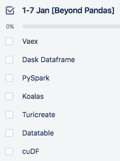
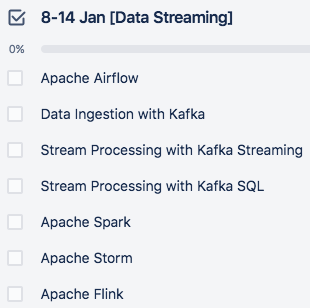
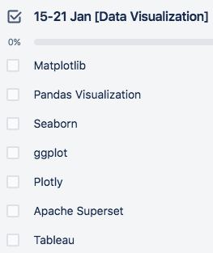
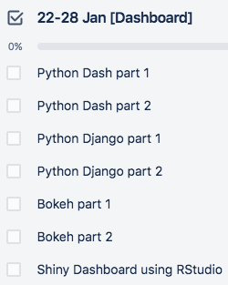

# 30daysofdatascience
My personal challenge for January 2021, to do quick review and analysis about different data science topics on daily basis (30-60 mins)

# Prepared Material
-  
-  

# Other Links
- Twitter thread [link](https://twitter.com/Enlik/status/1344822952836132866)
- Wrap up notebook [link](https://github.com/enliktjioe/30daysofdatascience/blob/master/day29-31_wrap_up.ipynb)